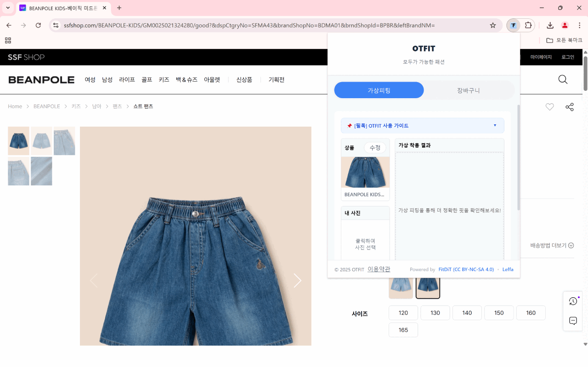

# 🛍️ OtFit Chrome Extension - OTFIT

**AI 기반 크롬 확장 프로그램으로 쇼핑몰의 옷을 내 사진에 가상 피팅해보세요!**  
더 이상 매장을 방문하거나 사이즈 걱정 없이, 누구나 스타일을 즐길 자유를 누릴 수 있도록 – **OTFIT**이 함께합니다.

[👉 Chrome 웹 스토어에서 설치하기](https://chromewebstore.google.com/detail/cfdepeimbnkpaebbcfebmdgfnfanlckp?utm_source=item-share-cb)

---

## ✨ 서비스 소개

**OTFIT**은 이미지 기반 AI 합성 기술을 활용하여 사용자가 원하는 옷을 자신의 사진에 가상으로 입혀볼 수 있는 **Chrome 익스텐션 서비스**입니다.  
신체적 불편함, 시공간적 제약, 또는 온라인 쇼핑의 불안함 때문에 피팅이 어려웠던 모든 사람들을 위해, 누구나 자유롭게 스타일을 탐색하고 표현할 수 있는 환경을 제공합니다.

---

## 🌟 주요 특징

### 1. 사진 업로드만으로 가상 피팅

- 번거로운 탈의 없이, 원하는 옷을 클릭하고 내 사진을 업로드하면 바로 착용한 모습을 확인할 수 있어요.

### 2. 배리어프리(Barrier-Free) 스타일 체험

- 휠체어 사용자, 의족·의수 착용자 등 **모든 체형과 조건을 존중**하며 누구나 쉽고 자유롭게 스타일을 시도할 수 있습니다.

### 3. 해외 직구 실패 줄이기

- 착용해보지 못해 망설였던 해외 의류 쇼핑도, **사전에 핏을 확인**하고 안심 구매할 수 있어요.

### 4. 다양한 체형과 개성 존중

- 마른 체형, 근육질, 플러스 사이즈 등 **모든 체형을 고려한 맞춤형 피팅**을 지원합니다.

### 5. AI 기반의 정밀한 핏 분석

- 단순 이미지 합성이 아닌, AI가 사용자의 체형과 비율을 분석하여 실제에 가까운 피팅 결과를 제공합니다.

---

## 🔗 지금 바로 OTFIT을 사용해보세요!

> **누구나 스타일리시할 권리가 있습니다.**  
> 패션을 사랑하는 모든 사람들을 위한 배리어프리 가상 피팅 솔루션 – **OTFIT**과 함께 하세요.

[✅ 웹 스토어 바로가기](https://chromewebstore.google.com/detail/cfdepeimbnkpaebbcfebmdgfnfanlckp?utm_source=item-share-cb)

---

## 📸 데모

  

---

## 📂 프로젝트 구조 및 기술

- **Frontend**: React + Vite 기반 Chrome Extension
- **AI 처리**: Hugging Face 상업용 모델 API 활용
- **기능**:
  - 사용자 사진 업로드
  - 쇼핑몰 옷 이미지 자동 추출 및 합성
  - 가상 피팅 결과 저장 및 장바구니 기능

---

## 🙌 함께 스타일을 표현하세요

OTFIT은 단순한 기능을 넘어, **누구나 자신의 스타일을 자유롭게 탐색할 수 있는 경험**을 제공합니다.  
더 이상 제약 없이! 더 이상 두려움 없이! 나만의 패션을 지금 바로 시도해보세요.
